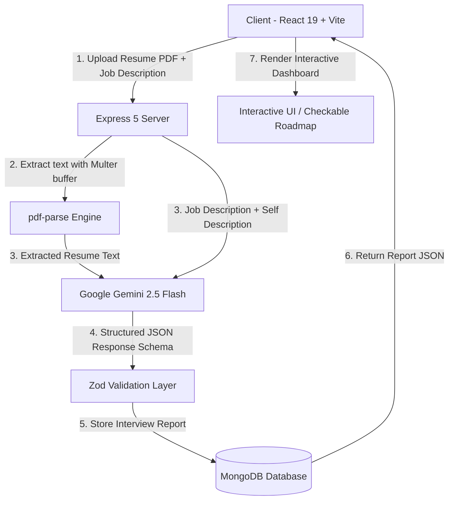

# 🚀 AI-Powered Interview Preparation Platform

An end-to-end full-stack intelligent interview preparation platform built with the **MERN stack** and **Google Gemini Generative AI**. The application analyzes candidate resumes (PDF) alongside job descriptions to produce customized interview strategies, role match scores, targeted technical and behavioral questions, day-by-day actionable roadmaps, and competency skill gap breakdowns.

---

## 📑 Table of Contents

- [Key Features](#-key-features)
- [Architecture & Workflow](#-architecture--workflow)
- [Tech Stack](#-tech-stack)
- [Repository Structure](#-repository-structure)
- [API Endpoints](#-api-endpoints)
- [Environment Variables](#-environment-variables)
- [Getting Started](#-getting-started)
  - [Prerequisites](#prerequisites)
  - [Backend Setup](#backend-setup)
  - [Frontend Setup](#frontend-setup)
- [Core Engineering Highlights](#-core-engineering-highlights)
- [License](#-license)

---

## ✨ Key Features

- **Resume Parsing & Profile Analysis**: Extracts plain text from uploaded PDF resumes using `@google/genai` and `pdf-parse` in-memory buffers.
- **AI-Driven Strategy Generation**: Uses Google Gemini to generate structured, strictly typed interview plans enforced via Zod and JSON Schema definitions.
- **Match Score & Readiness Gauge**: Calculates an objective 0–100% role match score comparing candidate strengths against role prerequisites.
- **Deep-Dive Technical & Behavioral Questions**:
  - Technical questions curated around candidate projects, tech stack, and CS fundamentals.
  - Behavioral questions with STAR (Situation, Task, Action, Result) response frameworks and interviewer evaluation objectives.
- **Interactive Checkable Roadmap**: Day-by-day preparation schedule with interactive task completion checkboxes and progress tracking.
- **Competency Skill Gap Analysis**: Categorizes missing skills with severity meters (*High*, *Medium*, *Low*) and actionable preparation guidance.
- **Dual-Layer Authentication & Security**:
  - Secure password hashing with `bcrypt`.
  - JWT session authorization supporting both `HttpOnly` cookies and `Authorization: Bearer <token>` request interceptors.
  - Server-side token blacklisting on logout.
- **Modern Responsive Dark UI**: Built with React 19, Tailwind CSS v4, and React Icons. Includes copy-to-clipboard utilities, real-time query filters, and clean print/PDF stylesheets.

---

## 🏛 Architecture & Workflow



---

## 🛠 Tech Stack

### **Frontend**
- **Framework**: React 19 + Vite 8
- **Routing**: React Router DOM v7
- **Styling**: Tailwind CSS v4 + Vanilla CSS Design System
- **Icons**: React Icons (`react-icons/fi`)
- **HTTP Client**: Axios (with custom JWT request interceptors)

### **Backend**
- **Runtime**: Node.js
- **Framework**: Express.js 5
- **Database**: MongoDB Atlas with Mongoose 9 ODM
- **AI Integration**: `@google/genai` (Gemini 2.5 Flash)
- **Validation**: Zod 4
- **File Upload & Parsing**: Multer (Memory Storage) + `pdf-parse` v2
- **Auth & Security**: JSON Web Tokens (`jsonwebtoken`), `bcrypt`, `cookie-parser`, `cors`

---

## 📁 Repository Structure

```text
├── Backend/
│   ├── src/
│   │   ├── Controller/
│   │   │   ├── auth.controller.js          # Register, login, logout, getMe handlers
│   │   │   └── interview.controller.js     # Report generation, retrieval & listing
│   │   ├── DB_Connection/
│   │   │   └── db.js                       # Mongoose connection with DNS fallback
│   │   ├── Middleware/
│   │   │   ├── auth.middleware.js          # JWT & Token blacklist validator
│   │   │   └── file.middleware.js          # Multer memory storage configuration
│   │   ├── Models/
│   │   │   ├── blackList.model.js          # Invalidated token blacklist
│   │   │   ├── interviewReport.model.js    # Interview report schema & subdocuments
│   │   │   └── user.model.js               # User authentication model
│   │   ├── Routes/
│   │   │   ├── auth.routes.js              # Auth endpoints (/api/auth)
│   │   │   └── interview.route.js          # Interview endpoints (/api/interview)
│   │   ├── Services/
│   │   │   └── ai.services.js              # Gemini AI prompt & schema orchestration
│   │   └── app.js                          # Express app configuration & CORS
│   ├── .env.example                        # Template — copy to .env and fill in your values
│   ├── package.json
│   └── server.js                           # Entry point
│
├── Frontend/
│   ├── src/
│   │   ├── Features/
│   │   │   ├── auth/
│   │   │   │   ├── Components/ProtectedRoute.jsx
│   │   │   │   ├── Hooks/useAuth.js
│   │   │   │   ├── auth.context.jsx
│   │   │   │   └── pages/                  # Login.jsx, Register.jsx
│   │   │   ├── interview/
│   │   │   │   ├── Pages/                  # Home.jsx, InterviewReport.jsx
│   │   │   │   ├── hook/useInterview.js
│   │   │   │   ├── interview.context.jsx
│   │   │   │   └── services/interview.api.js
│   │   │   └── services/auth.api.js        # Axios instance & auth endpoints
│   │   ├── App.jsx
│   │   ├── app.route.jsx                   # Browser router configuration
│   │   ├── index.css                       # Global design system & print styles
│   │   └── main.jsx
│   ├── package.json
│   └── vite.config.js                      # Vite proxy & Tailwind plugin setup
│
└── README.md
```

---

## 📡 API Endpoints

### **Authentication (`/api/auth`)**
| Method | Endpoint | Access | Description |
| :--- | :--- | :--- | :--- |
| `POST` | `/api/auth/register` | Public | Register user (`username`, `email`, `password`) |
| `POST` | `/api/auth/login` | Public | Authenticate user & issue JWT |
| `GET` | `/api/auth/logout` | Public | Clear cookie & blacklist active token |
| `GET` | `/api/auth/get-me` | Private | Retrieve authenticated user profile |

### **Interview Reports (`/api/interview`)**
| Method | Endpoint | Access | Description |
| :--- | :--- | :--- | :--- |
| `POST` | `/api/interview/generate-interview-report` | Private | Generate AI report via `multipart/form-data` (`resume`, `jobDescription`, `selfDescription`) |
| `GET` | `/api/interview/get-interview-report/:interviewId` | Private | Fetch single report details by MongoDB `_id` |
| `GET` | `/api/interview/get-all-interview-reports` | Private | List all past report summaries for authenticated user |

---

## 🔐 Environment Variables

Copy the example file and fill in your own values:

```bash
cp Backend/.env.example Backend/.env
```

Then edit `Backend/.env`:

```env
# Server Port
PORT=5000

# MongoDB Connection String (Atlas or Local)
MONGODB_URI=mongodb+srv://<your-username>:<your-password>@<your-cluster>.mongodb.net/<your-db-name>

# Secret key for JWT signing — use a long random string
JWT_SECRET=<your-strong-random-secret>

# Google Gemini API Key — get from https://aistudio.google.com/
GEMINI_API_KEY=<your-gemini-api-key>
```

---

## 🚦 Getting Started

### Prerequisites
- **Node.js** (v18.0.0 or higher recommended)
- **npm** or **yarn**
- **MongoDB Atlas** cluster or local MongoDB instance
- **Google Gemini API Key** ([Google AI Studio](https://aistudio.google.com/))

---

### Backend Setup

1. Open a terminal and navigate to the `Backend` directory:
   ```bash
   cd Backend
   ```
2. Install server dependencies:
   ```bash
   npm install
   ```
3. Configure your `Backend/.env` file with your database URI and API keys.
4. Start the backend development server:
   ```bash
   npm run dev
   ```
   *The server will start at `http://localhost:5000`.*

---

### Frontend Setup

1. Open a second terminal and navigate to the `Frontend` directory:
   ```bash
   cd Frontend
   ```
2. Install frontend dependencies:
   ```bash
   npm install
   ```
3. Start the Vite development server:
   ```bash
   npm run dev
   ```
   *The frontend will be accessible at `http://localhost:5173`.*

---

## 💡 Core Engineering Highlights

- **Structured AI Output Validation**: Uses Gemini `responseSchema` paired with Zod runtime parsing to guarantee deterministic JSON output, eliminating markdown fence issues or malformed payload responses.
- **DNS Resilience in Node.js**: Includes an automated fallback in `DB_Connection/db.js` resolving MongoDB Atlas SRV query issues across varying ISP and VPN networks.
- **Dual-Layer Auth Resilience**: Stores JWT in both `HttpOnly` cookies and client-side memory/storage with automatic Axios interceptor headers, preventing session drops in privacy-hardened or third-party cookie-restricted browser environments.
- **Zero-Storage PDF Extraction**: Resumes are processed strictly in RAM via Multer `memoryStorage` and destroyed immediately after parsing, ensuring zero temporary files remain on the server disk.

---

## 📄 License

This project is licensed under the **ISC License**. Free for educational and personal use.
